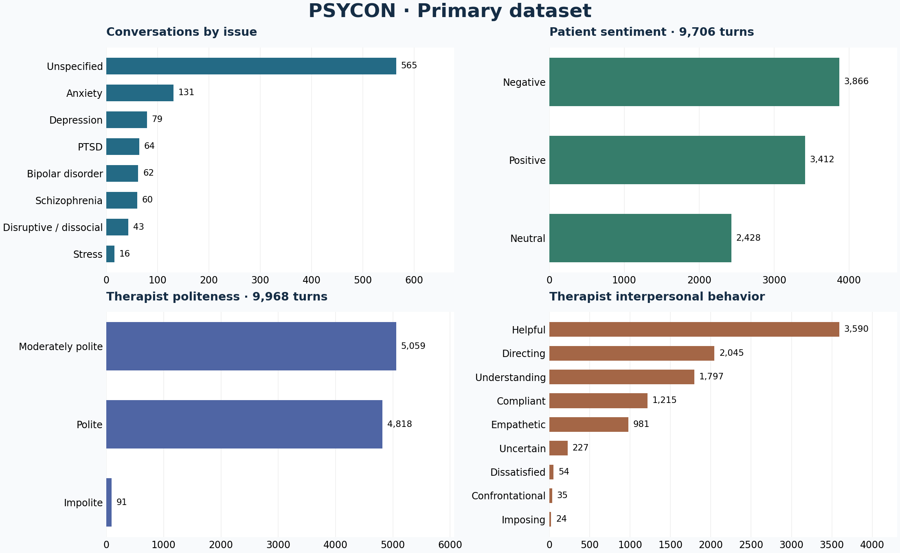
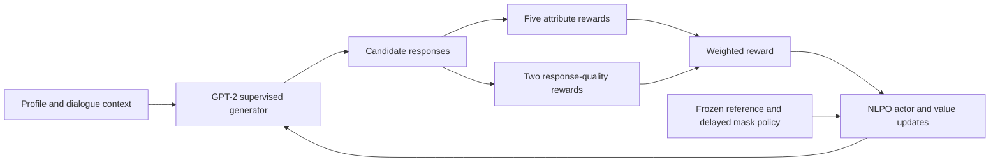

# e-THERAPIST

**I suggest you to cultivate a mindset of positivity and nurture uplifting thoughts**

Research code and PSYCON dialogue data for the [EMNLP 2023 paper](https://aclanthology.org/2023.emnlp-main.861/) by **Kshitij Mishra, Priyanshu Priya, Manisha Burja, and Asif Ekbal**.

[Paper](https://aclanthology.org/2023.emnlp-main.861.pdf) · [Dataset](data/README.md) · [Implementation](docs/implementation.md) · [Reported results](docs/results.md) · [Citation](CITATION.bib)

e-THERAPIST studies personalized patient–therapist dialogue generation. A GPT-2 generator uses the patient's profile and conversation context, while six classifiers and seven rewards guide politeness, interpersonal behavior, and response quality through natural language policy optimization (NLPO).

## Quick start

Use Python 3.11 or newer.

```bash
git clone https://github.com/Mishrakshitij/e-THERAPIST.git
cd e-THERAPIST
python -m venv .venv
source .venv/bin/activate
python -m pip install -e '.[metrics,dev]'

python -m e_therapist inspect
python -m e_therapist smoke
python -m pytest -q
```

The smoke command runs entirely offline with small, randomly initialized models and toy fixtures. It exercises supervised training, all six classifiers, the seven reward functions, an NLPO update, generation, and checkpoint loading. Diagnostics are written to `runs/smoke/`.

Add `--neural-rewards` to also run the complete NLPO loop with tiny neural reward models and BERTScore; this requires the `metrics` extra and remains offline.

## Dataset

This reconstructed release combines the supplied PSYCON and counseling dialogue files into **1,020 conversations**, **19,676 turns**, and **9,529 response-generation examples**. It matches the paper's conversation count; the paper reports **25,071 turns**, so the supplied conversations do not reproduce its full corpus. Counts below describe the files in this repository.

| Split | Conversations | Turns | Response examples |
| --- | ---: | ---: | ---: |
| Train | 816 | 15,509 | 7,515 |
| Validation | 102 | 2,093 | 1,014 |
| Test | 102 | 2,074 | 1,000 |
| **Total** | **1,020** | **19,676** | **9,529** |

The CSV is [`data/psycon/psycon.csv`](data/psycon/psycon.csv). It contains conversation and turn identifiers, speaker, utterance, psychological issue, gender, age, persona, sentiment, politeness, interpersonal behavior, and psychotherapeutic approach. Unavailable profile fields remain empty. Two empty utterances retain their identifiers and are excluded from training; context restarts at gaps in turn numbering.

| Task | Classes |
| --- | --- |
| Gender–age | Female/male × young/adult/elder |
| Persona | Openness, conscientiousness, extraversion, agreeableness, neuroticism |
| Sentiment | Negative, neutral, positive |
| Politeness | Impolite, moderately polite, polite |
| Interpersonal behavior | Confrontational, imposing, dissatisfied, uncertain, compliant, helpful, understanding, empathetic, directing |
| Psychotherapeutic approach | Directive, non-directive, eclectic |



The [dataset guide](data/README.md) provides the complete schema, distributions, and missing-value counts. [`splits.json`](data/psycon/splits.json) records conversation membership; identical full transcripts and shared substantial opening questions stay together. [`manifest.json`](data/psycon/manifest.json) includes file checksums.

```python
from e_therapist.data import load_turns, load_examples

turns = load_turns("data/psycon/psycon.csv")
train = load_examples("data/psycon/psycon.csv", split="train")
print(train[0]["prompt"])
print(train[0]["response"])
```

## Method



The implementation includes response-only language-model cross-entropy, classifier cross-entropy, all seven reward functions, token-level KL regularization, generalized advantage estimation, clipped policy and value losses, entropy, and delayed top-p masking. The [implementation guide](docs/implementation.md) maps these components to the equations and explains configurable defaults.

## Train

The full configurations use GPT-2-medium and RoBERTa-large. Their first use downloads pretrained backbones; training writes checkpoints and metrics under `runs/`. GPU memory requirements depend on batch size, sequence length, and reward placement. Reward classifiers run on CPU by default and can be moved with `reward_device`.

```bash
# Train the six task classifiers and the supervised generator.
python -m e_therapist train-classifiers --config configs/classifiers.yaml
python -m e_therapist train-sft --config configs/sft.yaml

# Optimize the generator with the trained reward models.
python -m e_therapist train-nlpo --config configs/nlpo.yaml
```

For a single classifier, add `--task sentiment` (or `gender_age`, `persona`, `approach`, `politeness`, `ipc`). Classifiers train on available targets. The NLPO configuration uses observed attributes and renormalizes their reward weights when profile labels are missing. Supervised training saves the best validation checkpoint. NLPO saves the latest policy and value head to `runs/nlpo/last/`.

`bash scripts/train_all.sh` runs the complete sequence and final evaluation. Edit the YAML configurations to change model paths, batch sizes, learning rates, reward weights, or training duration.

## Evaluate and generate

```bash
python -m e_therapist evaluate \
  --config configs/nlpo.yaml --checkpoint runs/nlpo/last \
  --classifiers runs/classifiers --bertscore --output runs/evaluation

python -m e_therapist evaluate-classifier --task ipc

python -m e_therapist generate --checkpoint runs/nlpo/last \
  --text "I have been finding it hard to focus lately." \
  --gender female --age adult --persona openness --sentiment negative
```

Generator evaluation writes per-example predictions and corpus metrics: response perplexity, BERTScore-F1, response length, distinct n-grams, and the five attribute-success scores. Classifier evaluation reports accuracy, macro-F1, weighted-F1, and per-class support. Add `--limit 20` for a short generator check. Generation can infer sentiment using `--classifiers runs/classifiers` in place of `--sentiment`. Gender, age, and persona arguments are optional; omit unavailable profile fields.

## Repository layout

```text
configs/                Experiment settings
data/psycon/            Dataset, split IDs, statistics, checksums
docs/                   Implementation details and paper results
scripts/                Training and dataset-figure commands
src/e_therapist/
  data.py, schema.py    Validated data and task vocabularies
  models.py            Causal policy/value model and classifiers
  losses.py            Supervised and reinforcement-learning losses
  rewards.py           Seven reward equations and weighted combination
  scoring.py           Frozen classifier, BERTScore, and fluency scoring
  training.py, rl.py    Supervised training and NLPO
  evaluation.py        Metrics and response generation
  cli.py, smoke.py      Commands and offline integration check
tests/                  Numerical, data, and integration tests
```

## Citation

```bibtex
@inproceedings{mishra-etal-2023-e,
  title = {{e-THERAPIST}: I suggest you to cultivate a mindset of positivity and nurture uplifting thoughts},
  author = {Mishra, Kshitij and Priya, Priyanshu and Burja, Manisha and Ekbal, Asif},
  booktitle = {Proceedings of the 2023 Conference on Empirical Methods in Natural Language Processing},
  year = {2023},
  pages = {13952--13967},
  publisher = {Association for Computational Linguistics},
  doi = {10.18653/v1/2023.emnlp-main.861},
  url = {https://aclanthology.org/2023.emnlp-main.861/}
}
```
